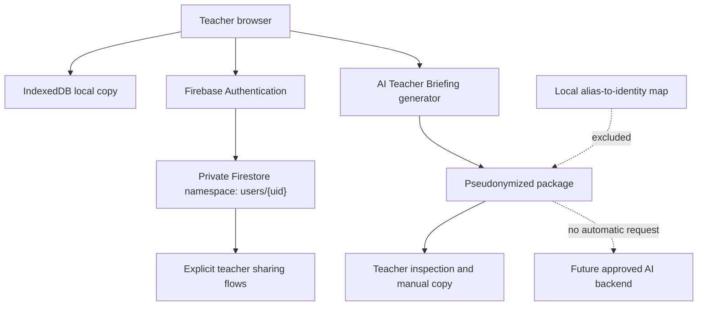

# Privacy Architecture For Judges

This is a concise English explanation of AvaluaPro's privacy architecture and the Build Week feature. It is not a legal
compliance certificate. The larger institutional dossier is maintained separately in Catalan and remains preliminary
until an education authority, legal reviewer and technical reviewer approve the relevant decisions.

## Core Position

Professional infrastructure, encryption and Google Authentication are important controls, but they are not enough on
their own to establish lawful or responsible processing of student data.

AvaluaPro therefore treats privacy as a combination of:

- data minimization;
- purpose and role definition;
- access control;
- explicit sharing boundaries;
- retention and deletion;
- incident and administrative governance;
- human review;
- technical and operational testing.

## Current Data Architecture

AvaluaPro can process student names, classes, competency results, task records, work habits, behavior, tutoring notes,
sociometric relationships, cooperative groups and classroom seating plans.



The application uses:

- IndexedDB for local resilience;
- Google sign-in through Firebase Authentication;
- a private Firestore data space under each authenticated teacher's UID;
- Firebase Hosting for the web app;
- controlled shared collections for grade packages, shared tutoring and temporary sociometric surveys.

Firebase web configuration is visible in the browser by design. Security depends on authenticated identity, Firestore
rules, project configuration and operational controls, not on treating a browser API key as a secret.

## Existing Controls

The current codebase includes:

- per-UID isolation for ordinary teacher data;
- explicit sender and recipient checks for teacher grade packages;
- owner and member controls for shared tutoring spaces;
- a closed list of allowed shared tutoring subcollections;
- revocation and voluntary-leave flows;
- deletion tombstones that remove pedagogical content while preventing stale devices from restoring deleted records;
- individual, non-enumerable, single-use sociometric survey tokens with a 24-hour lifetime;
- data-minimization guidance and length limits in sensitive free-text fields;
- differentiated exports so ordinary grade packages exclude diagnostics, photos, sociometry and tutoring notes;
- automated Firestore Rules, synchronization, retention and privacy tests.

These controls reduce risk. They do not remove the risks of a compromised teacher account, an unlocked device, an
unprotected manual export, excessive free text or inappropriate institutional access.

## Build Week AI Boundary

The Build Week feature creates a deliberately reduced package from existing classroom signals.

### Included

- class-level grade distribution;
- competency averages and evidence counts;
- task coverage and consistency metrics;
- behavior incident counts;
- limited sociometric counts;
- cooperative-group availability;
- selected focus-student signals under temporary aliases.

### Excluded

- names and surnames;
- email addresses;
- photos;
- diagnosis labels;
- family information;
- raw free-text observations;
- the local alias-to-identity map.

The package also records its own guardrails, including that human review is required and direct identifiers, diagnosis
labels and free text are not included.

## Encryption, Pseudonymization And Anonymization

| Measure | What it helps with | What it does not solve |
| --- | --- | --- |
| Encryption | Reduces exposure in transit and at rest. | Authorized users and services still process personal data. |
| Pseudonymization | Separates identity from selected educational signals and reduces some breach impact. | The data remains personal if the identity can be recovered or inferred. |
| Anonymization | Makes re-identification no longer reasonably likely. | It is generally incompatible with an operational teacher record that must refer back to a learner. |

`Student A` is therefore pseudonymous, not anonymous, when AvaluaPro still knows who that student is.

## Why There Is No Browser-Side AI Call

The Build Week extension does not place an OpenAI API key in the browser and does not automatically transmit student
signals to an external model.

That is an intentional product boundary. A future direct integration should use:

1. a server-side connector;
2. an institutionally approved provider and processing agreement;
3. documented retention, location and subprocessors;
4. purpose limitation and request auditing;
5. a completed data-protection impact assessment where required;
6. human review before any output affects a learner.

## Residual Risks And Pending Work

AvaluaPro does not claim that the current product is already approved for unrestricted institutional use. Important work
before a broad real-data pilot includes:

- a full manual test with at least two real teacher accounts using fictitious students;
- simultaneous editing and conflict tests on real devices;
- separate development, test and production environments;
- stronger administrator governance, MFA, logging and alerting;
- verified backup and restoration exercises;
- final retention and annual deletion decisions from the responsible institution;
- external technical review proportional to the risk;
- approval of the impact assessment, processor agreement and participant information.

## Evidence

- Build Week privacy test: [`tests/ai-teacher-briefing.test.js`](tests/ai-teacher-briefing.test.js)
- Firestore rules: [`firestore.rules`](firestore.rules)
- Shared tutoring test: [`tests/shared-tutoring-sync.test.js`](tests/shared-tutoring-sync.test.js)
- Retention test: [`tests/sociometric-retention.test.js`](tests/sociometric-retention.test.js)
- Full Build Week explanation: [`BUILD_WEEK_2026.md`](BUILD_WEEK_2026.md)

Run the full repository security suite with:

```bash
npm run test:security
```

## Responsible Interpretation

The architecture is a defensible technical foundation, not a shortcut around educational data-protection obligations.
The Build Week contribution demonstrates a practical pattern: minimize and expose the outgoing package to the teacher
before introducing an external AI processor.
