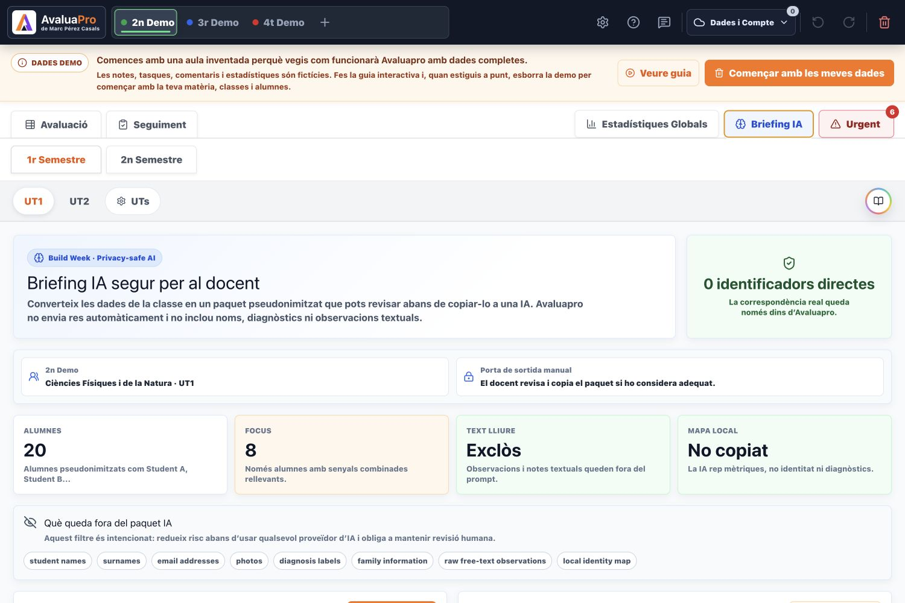
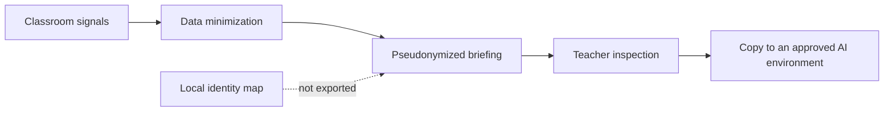

# AvaluaPro

> Privacy-conscious classroom intelligence for competency assessment, daily follow-up, tutoring and earlier teacher intervention.

[Live demo](https://avaluapro.web.app/) | [5-minute judge guide](JUDGES_GUIDE.md) | [Build Week evidence](BUILD_WEEK_2026.md) | [Privacy architecture](PRIVACY_FOR_JUDGES.md)



AvaluaPro is a working web application created by a teacher for the daily reality of teaching. It combines competency
assessment, task completion, work habits, behavior, tutoring, sociometry, cooperative groups, seating plans and
cross-signal analytics in one workspace.

The product was designed in Andorra around the competency-based needs of its education system. It has been presented to
the Andorran Ministry of Education while a possible pilot and institutional model are explored. This does not imply an
official endorsement.

## OpenAI Build Week 2026

AvaluaPro existed before OpenAI Build Week. During the submission period, it was meaningfully extended with Codex through
a new feature: the **privacy-conscious AI Teacher Briefing**.

Submission track: **Education**.

The extension:

- combines learning, consistency, behavior and sociometric signals;
- replaces student identities with aliases such as `Student A`;
- excludes names, surnames, email addresses, photos, diagnosis labels, family information and raw free-text observations;
- keeps the alias-to-identity map inside AvaluaPro and outside the copied package;
- lets the teacher inspect the exact prompt and JSON before anything leaves the app;
- requires human review and does not automatically send data to an AI provider.

The Build Week implementation is documented in [BUILD_WEEK_2026.md](BUILD_WEEK_2026.md). The main feature commit is
[`537ee16`](https://github.com/marcpcasals/avaluapro/commit/537ee16).

## Try It In 90 Seconds

No account or real student data is required.

1. Open the [live demo](https://avaluapro.web.app/).
2. Keep the fictitious demo classroom loaded on first launch.
3. Click `Briefing IA` (`AI Briefing`) in the main navigation.
4. Confirm that the summary reports `0 identificadors directes` (`0 direct identifiers`).
5. Inspect the pseudonymized prompt and JSON package.
6. Confirm that focus learners appear only as `Student A`, `Student B`, and similar aliases.
7. Review the fields explicitly excluded from the package.

The app interface is currently in Catalan. [JUDGES_GUIDE.md](JUDGES_GUIDE.md) provides complete English testing
instructions and a translation key for the relevant controls.

## What AvaluaPro Does

- **Competency assessment:** fast A/B/C/D assessment across competencies, criteria, units and semesters.
- **Daily follow-up:** task completion, late or missing work, consistency and intervention signals.
- **Classroom analytics:** achievement, habits and behavior are combined into actionable priorities.
- **Tutor mode:** a whole-class view across academic and tutorial information.
- **Sociometry:** relationships, group dynamics and sociometric questionnaires.
- **Cooperative groups:** configurable group proposals with teacher review.
- **Classroom seating:** flexible seating plans informed by classroom context.
- **Teacher collaboration:** controlled grade packages and shared tutoring spaces.
- **Backup and synchronization:** local resilience with optional authenticated cloud synchronization.

## The Build Week Privacy Gate



The exported package is **pseudonymized, not anonymous**. AvaluaPro can still map an alias back to a learner locally, so
the package must continue to be handled as personal educational data. The feature reduces exposure; it does not claim to
remove every legal or re-identification risk.

## Built With

- React 19 and React DOM
- Vite 8
- JavaScript
- Zustand
- IndexedDB
- Firebase Authentication
- Cloud Firestore
- Firebase Hosting
- Firebase Security Rules and Rules Unit Testing
- Tailwind CSS
- Node.js built-in test runner
- OpenAI Codex as the engineering partner for the Build Week extension

## Run Locally

The project currently uses Node.js 22 and npm.

```bash
npm install
npm run dev
```

Vite will print the local URL in the terminal. The fictitious demo classroom loads automatically on first launch.

Create a production build:

```bash
npm run build
```

## Tests

Run the Build Week privacy test:

```bash
npm run test:ai-briefing
```

Run the broader security suite:

```bash
npm run test:security
```

Run static and production checks:

```bash
npm run lint
npm run build
```

## Judge Documentation

| Document | Purpose |
| --- | --- |
| [JUDGES_GUIDE.md](JUDGES_GUIDE.md) | English testing path, Catalan UI translation and expected results. |
| [BUILD_WEEK_2026.md](BUILD_WEEK_2026.md) | Clear separation of pre-existing work and the Build Week extension. |
| [PRIVACY_FOR_JUDGES.md](PRIVACY_FOR_JUDGES.md) | Concise architecture, privacy controls, residual risks and current limits. |
| [Devpost Project Story](docs/devpost-openai-build-week-submission.md) | Copy-ready submission narrative and demo notes. |
| [Image gallery](docs/devpost-media/README.md) | Recommended screenshots, order and English captions. |

The repository also contains a larger Catalan institutional dossier covering data protection, security, retention,
incident response, processor agreements and a preliminary impact assessment. Those documents predate Build Week and are
working materials for a possible educational pilot; they are not presented as completed legal approval.

## Responsible Testing

- Use only the fictitious classroom included with the app.
- Do not enter real student information during judging or public demonstrations.
- The Build Week feature does not call an external AI provider.
- Direct AI integration remains future work and would require an approved backend, contractual safeguards, retention
  controls and institutional data-protection review.

## Ownership And License

Copyright 2026 Marc Pérez Casals. AvaluaPro is currently proprietary software made available for OpenAI Build Week
evaluation. See [LICENSE](LICENSE) for the evaluation permission and restrictions.
