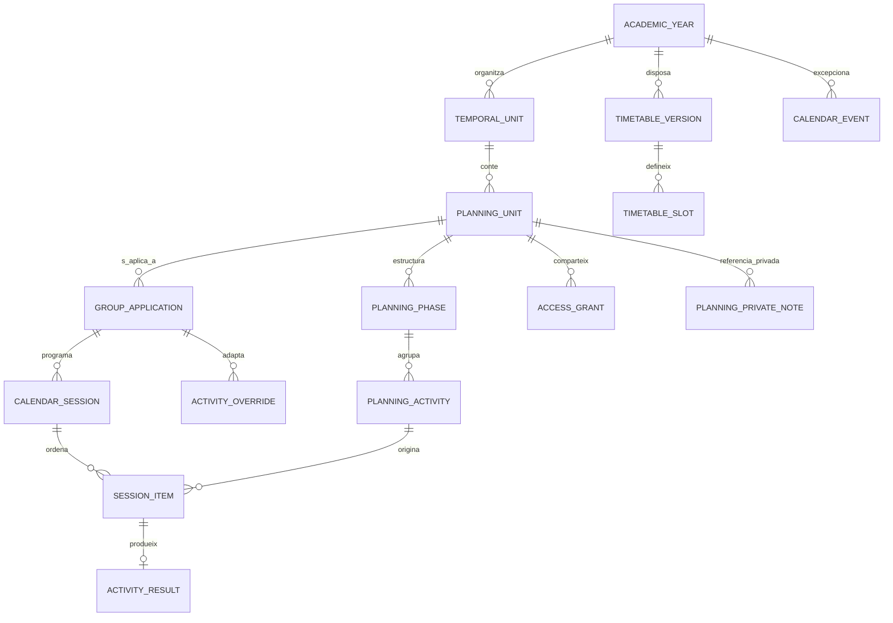

# Model de dades de Planificació — versió 1

Aquest document descriu el contracte de domini implementat a `src/domain/planning/`, la seva persistència local-first i les formes acceptades per les regles de Firebase.

## Mapa d'entitats



## Contracte comú

Totes les entitats tenen:

| Camp | Ús |
|---|---|
| `id` | Identificador estable amb prefix `plan-*` |
| `entityType` | Tipus d'entitat que permet validar i migrar |
| `schemaVersion` | Versió de l'esquema; inicialment `1` |
| `createdAt` | Moment de creació |
| `updatedAt` | Última modificació |
| `ownerUid` | Propietari, excepte quan la relació ja el determina |

Els noms, les dates i l'ordre són camps editables i no formen part de l'identificador.

## Entitats

| Entitat | Propòsit | Relacions principals |
|---|---|---|
| `academicYear` | Curs acadèmic amb inici i final configurables | Propietari de les UT i horaris |
| `temporalUnit` | UT amb dates pròpies i ordre anual | Pertany a un curs |
| `planningUnit` | UP base i ideal d'un curs concret | Pertany a una UT; té fases i activitats |
| `planningPhase` | Fase o subfase reordenable | Pertany a una UP; `parentPhaseId` permet subfases |
| `planningActivity` | Element reutilitzable de la seqüència | Pertany a una fase i conserva tipus, materials, temps i indicadors |
| `groupApplication` | Aplicació d'una UP a un grup real | Enllaça UP, versió, curs i classe |
| `activityOverride` | Diferència que només afecta un grup | Enllaça l'aplicació i l'activitat base |
| `timetableVersion` | Horari vigent durant un període | Pertany al curs; té data d'entrada en vigor |
| `timetableSlot` | Franja setmanal | Enllaça horari, grup, assignatura, durada i mig grup opcional |
| `calendarEvent` | Festiu, dia no lectiu, classe extraordinària o cancel·lació | Afecta el curs i opcionalment grups concrets |
| `calendarSession` | Sessió concreta amb data i durada | Pertany a una aplicació de grup |
| `sessionItem` | Activitat, indicació o transició dins una sessió | Pot conservar el vincle amb l'activitat base |
| `activityResult` | Resultat pedagògic real | Enllaça sessió i element; no conté dades individuals privades |
| `accessGrant` | Lectura o coedició per correu exacte | Pertany a una UP i pot limitar-se a grups |
| `planningPrivateNote` | Nota personal separada de l'aplicació compartible | Referencia UP, aplicació o sessió; només la llegeix el propietari |

## Elements de la seqüència de la UP

`planningActivity.type` diferencia tres elements que es poden ordenar i moure entre fases:

- `activity`: activitat pedagògica amb temps, materials, agrupament i seguiment opcional;
- `indication`: recordatori dins la cronologia, habitualment sense temps;
- `transition`: pausa o canvi d'espai, amb temporització opcional.

Els tres tipus conserven un identificador estable quan es reordenen. Els materials es divideixen entre docent i alumnat i poden ser un enllaç extern o una referència física. No es desen fitxers dins de Firebase.

## Currículum llegible i enllaçat

`planningUnit.curriculum` conserva quatre llistes llegibles: competències, aprenentatges esperats, criteris d'avaluació i indicadors. Cada element té un identificador estable, el text que ha de veure direcció i un `sourceId` opcional quan s'ha incorporat des de l'avaluació d'AvaluaPro.

El text es desa com una fotografia dins la UP. Això evita que una programació històrica canviï o perdi significat si més endavant es renombra o s'elimina l'element original d'AvaluaPro. Els camps antics acabats en `Ids` es mantenen sincronitzats amb els `sourceId` per conservar compatibilitat.

Els indicadors de la UP es poden associar a una activitat mitjançant `planningActivity.indicatorIds`. Els recursos específics i transversals, els fets i conceptes, els procediments i les actituds i valors continuen com a llistes de text oficial dins de `planningUnit`.

## Mesures d'atenció a la diversitat

`planningActivity.diversityMeasures` només conserva la mesura pedagògica, la classe i l'alumnat seleccionat. La biblioteca d'AvaluaPro pot utilitzar els diagnòstics localment per suggerir i preseleccionar orientacions, però la normalització de domini descarta qualsevol diagnòstic o nota personal abans de persistir l'activitat.

Direcció pot consultar les mesures que formen part de la programació. Els diagnòstics complets, les observacions individuals i les notes personals continuen fora de la UP compartible i sota els permisos propis d'AvaluaPro.

## UP base i aplicació per grup

La UP base no es clona completament per a cada grup. L'aplicació guarda la relació i només registra excepcions.

```json
{
  "entityType": "groupApplication",
  "id": "plan-application-exemple",
  "planningUnitId": "plan-up-musica-1",
  "planningUnitVersion": 1,
  "classId": "grup-exemple",
  "status": "active",
  "schemaVersion": 1
}
```

Si aquest grup necessita 55 minuts per a una activitat prevista en 40, es crea una excepció:

```json
{
  "entityType": "activityOverride",
  "applicationId": "plan-application-exemple",
  "activityId": "plan-activity-escolta",
  "changeScope": "groupOnly",
  "changes": {
    "plannedMinutes": 55
  },
  "schemaVersion": 1
}
```

La `planningActivity` original continua marcant 40 minuts. Només l'abast `baseAndGroup` actualitza la UP base.

## Activitats repartides entre sessions

Una activitat de 120 minuts continua sent una sola activitat pedagògica. Cada part té un identificador propi com a element de sessió, però comparteix `sourceActivityId`.

```json
[
  {
    "id": "plan-session-item-part-1",
    "sessionId": "plan-session-dilluns",
    "sourceActivityId": "plan-activity-projecte",
    "segmentIndex": 1,
    "segmentCount": 2,
    "plannedMinutes": 55
  },
  {
    "id": "plan-session-item-part-2",
    "sessionId": "plan-session-dimecres",
    "sourceActivityId": "plan-activity-projecte",
    "segmentIndex": 2,
    "segmentCount": 2,
    "plannedMinutes": 65
  }
]
```

Les indicacions sense temporització tenen `plannedMinutes: null`. Formen part de la cronologia, però no consumeixen el pressupost de temps.

## Temps i càrrega de sessió

El domini reserva cinc minuts de marge per defecte:

| Durada de la franja | Minuts programables |
|---:|---:|
| 60 | 55 |
| 90 | 85 |
| 120 | 115 |

L'estat és verd fins al 85% inclòs, taronja per sobre del 85% i fins al 100%, i vermell quan se supera el temps programable.

## Versions anuals

Copiar una UP crea un identificador nou i incrementa `versionNumber`. El camp `copiedFrom` conserva:

- la UP d'origen;
- el curs d'origen;
- el moment de la còpia.

La versió antiga no es modifica. El flux complet de còpia crea identificadors nous per a la UP, totes les fases, les subfases i totes les activitats. Els `parentPhaseId` i `phaseId` es remapen dins la nova estructura, de manera que cap edició posterior pot arribar al document antic.

Els permisos no s'hereten entre cursos. La còpia comença sense persones convidades i el propietari decideix després si la comparteix. Cada activitat copiada incorpora també un `copiedFrom` amb la UP, l'activitat, el curs i el moment d'origen.

L'històric es consulta sota demanda. La càrrega inicial continua llegint únicament les UP del curs actiu; els cursos anteriors només es consulten quan el docent obre **Recuperar una activitat antiga**. La numeració `A1`, `A2`… es deriva de l'ordre visible de la seqüència i permet cercar una activitat pel número, el títol o la descripció.

## Comparació real i millora anual

`activityResult` ja pot registrar, a més del temps real, la reflexió i l'estat:

- materials que han faltat;
- adaptacions que han resultat útils;
- recomanació de conservar, modificar o retirar l'activitat.

`getActivityActualComparisons` agrupa aquests resultats per `sourceActivityId` i calcula la mitjana real per grup sense alterar la UP ideal. Quan la mitjana supera el temps previst, l'estat és `overrun` i la interfície el presenta en vermell.

Les evidències poden generar elements dins `planningUnit.improvementProposals`. Cada proposta conserva activitat, explicació, grups d'origen, comparació temporal i canvis suggerits. L'estat inicial és `pending`; només passa a `accepted` quan el docent la selecciona individualment o dins d'una acceptació conjunta. Acceptar una proposta aplica únicament els camps suggerits a la versió nova. Les observacions buides no creen propostes.

## Horaris versionats

Cada `timetableVersion` té `effectiveFrom` i un `effectiveTo` opcional. Per a una data concreta s'escull la versió vigent més recent. Les sessions ja creades conserven el seu `timetableSlotId` i no canvien si entra en vigor un horari nou.

## Privacitat i capacitats

`activityResult` només conté dades pedagògiques compartibles, com el temps real, l'estat, la reflexió, els materials que han faltat i la valoració de les adaptacions. `planningPrivateNote` viu en una col·lecció separada i només la pot llegir el propietari. Les incidències, l'assistència, els diagnòstics i les notes personals continuen en els àmbits protegits d'AvaluaPro; una activitat només rep la mesura pedagògica i l'alumnat seleccionat explícitament.

| Rol | UP | Editar UP | Aplicació real | Gestionar Agenda | Notes privades o incidències |
|---|---:|---:|---:|---:|---:|
| Propietari | Sí | Sí | Sí | Sí | Sí, segons els permisos d'AvaluaPro |
| Direcció | Sí | No | Sí | No | No |
| Editor de la UP | Sí | Sí | Només amb accés al grup | No | No per la invitació de Programació |
| Col·laborador UP + Agenda | Sí | Sí | Amb accés al grup | Amb accés al grup | No per la invitació de Programació |

Les regles de Firestore hauran de tornar a comprovar el propietari, el rol, la UP concreta i, quan correspongui, l'accés independent al grup.
