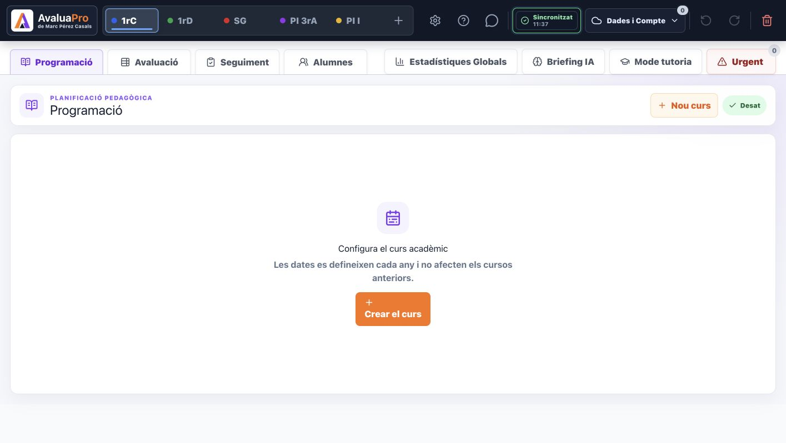
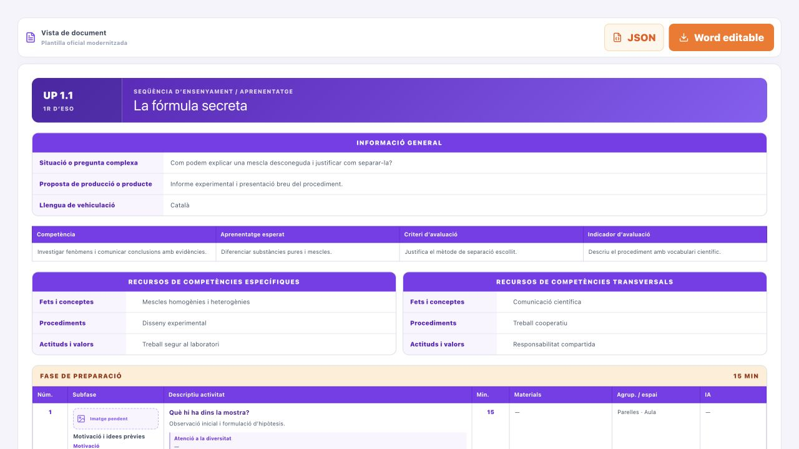
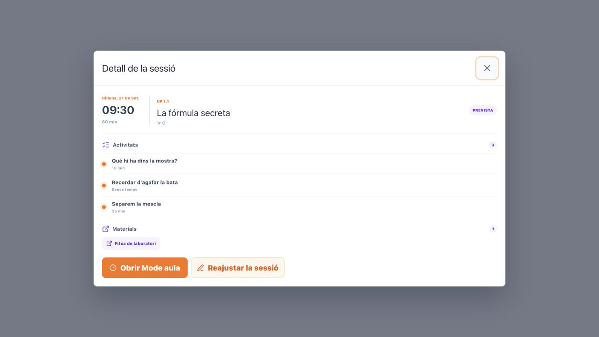
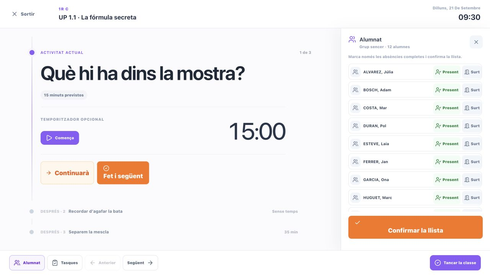
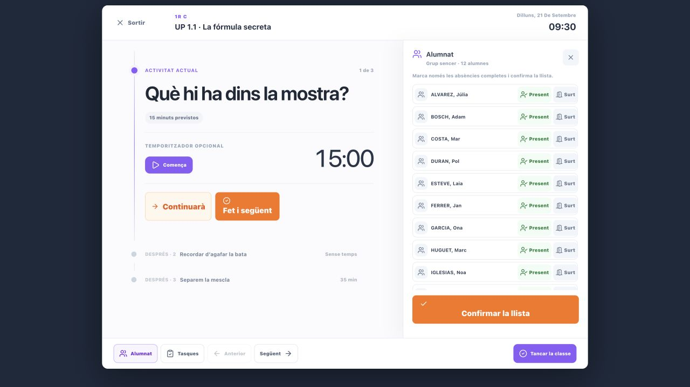
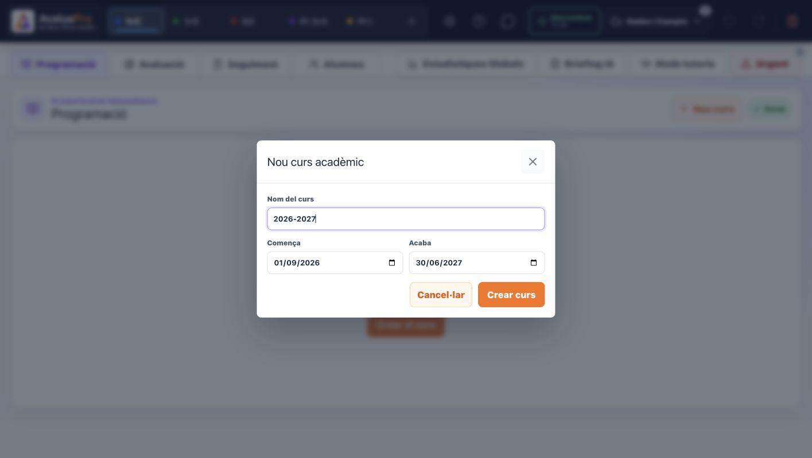

# Iteració 18 — Qualitat visual, accessibilitat i rendiment

Data de tancament: 19 de setembre de 2026.

## 1. Abast de l'auditoria

S'han revisat els recorreguts principals dels tres mòduls docents abans del pilot amb dades reals:

1. entrar a Programació i entendre l'estat inicial;
2. consultar una UP com a document;
3. obrir el detall d'una sessió d'Agenda;
4. treballar al Mode aula amb la cronologia i la llista d'alumnes;
5. obrir, recórrer i tancar diàlegs amb teclat;
6. reordenar activitats sense arrossegar;
7. comunicar càrrega, sincronització, errors i confirmacions;
8. comprovar ordinador i una finestra interior de 1024 × 768 px equivalent a l'iPad.

Les captures utilitzen dades sintètiques. L'estat inicial de Programació i el diàleg de curs acadèmic provenen de la versió publicada i autenticada; la resta s'ha representat amb els components reals en un entorn local controlat.

## 2. Objectiu d'ús

El producte està pensat per a docents que treballen principalment amb ordinador i, durant la classe, també amb iPad. La informació ha de ser densa però llegible, les accions habituals han de tenir una àrea tàctil suficient i cap recorregut essencial pot dependre només del color, del ratolí o d'arrossegar.

L'objectiu d'aquesta iteració és una base accessible i operativa per al pilot. No es declara una certificació completa WCAG: la verificació combina inspecció visual, recorreguts de teclat, mesures del DOM i proves funcionals, però no substitueix una auditoria formal amb diverses tecnologies d'assistència.

## 3. Resultat visual

### Programació

La pantalla buida explica què cal configurar i evita mostrar una interfície incompleta. La vista documental conserva la jerarquia violeta de la plantilla oficial, separa informació general, currículum, recursos i seqüència, i manté les exportacions visibles sense competir amb el document.

### Agenda

El detall de sessió presenta primer data, hora, grup i estat; després activitats i materials; finalment les dues accions útils. Els estats continuen escrits amb text i no depenen del color.

### Mode aula

La vista manté l'activitat actual com a focus principal i relega la resta a una cronologia discreta. La llista d'alumnes queda en un panell independent, amb accions sistemàtiques per assistència i sortida. En una amplada interior de 1024 px es conserva el mateix flux, sense perdre cap acció principal.

## 4. Problemes detectats i correccions

### Diàlegs

Abans de la correcció, el diàleg publicat era visualment clar però no tenia nom accessible, `Esc` no el tancava i, en tancar-lo, el focus acabava al cos de la pàgina.

S'ha creat un patró comú que:

- associa cada diàleg amb el seu títol;
- manté el focus dins del diàleg amb `Tab` i `Maj` + `Tab`;
- el tanca amb `Esc`;
- retorna el focus al control que l'havia obert;
- funciona també als diàlegs propis de Mode aula;
- anuncia els errors de formulari com a alertes.

La prova manual ha confirmat el recorregut complet: el focus inicial entra al primer camp, recorre els controls, torna de l'últim al primer i es restaura al botó d'origen en tancar.

### Reordenació i pestanyes

La seqüència d'activitats només permetia reordenar amb arrossegament. La nansa admet ara `Alt` + fletxa amunt o avall, conserva el focus i pot moure una activitat dins d'una fase o entre fases. La prova manual ha comprovat també que la numeració es recalcula després del moviment.

Les pestanyes de documents, reajustament de sessió i vista compartida comparteixen una única funció de teclat: fletxes per avançar o retrocedir i `Inici`/`Fi` per anar als extrems. Això elimina dues implementacions duplicades.

### Mode aula

La primera mesura va detectar 17 controls visibles per sota de 32 px i 48 fragments de text per sota de 10 px; tres d'aquests controls pertanyien només al selector temporal de l'auditoria. Després de la correcció, els 49 controls reals visibles superen 24 × 24 px i no queda cap text visible per sota de 10 px en la pantalla principal auditada.

També s'han afegit:

- focus visible coherent;
- mida tàctil més gran per a assistència, sortida, tasques i tancament;
- `aria-pressed` als panells d'Alumnat i Tasques;
- etiquetes completes encara que el text visual de la sortida sigui més breu;
- reducció d'animacions quan el sistema ho demana.

## 5. Estats, color i informació ambigua

- Els estats de sincronització ja exposen sis situacions diferenciades i les proves en validen la prioritat.
- Les consultes remotes fallides retornen la còpia local sense eliminar-la; una consulta parcial no interpreta absències com a esborrats.
- Els errors visibles de Programació, Agenda i Mode aula s'anuncien com a alertes.
- Els missatges d'èxit i sincronització s'exposen com a estats vius no intrusius.
- Els estats de sessió, temporització, assistència i càrrega inclouen text o icona a més del color.
- El focus visible utilitza violeta o el color actiu del grup amb contorn i separació suficients.

## 6. Rendiment i càrrega

La compilació continua separant Programació i Agenda del nucli principal. La importació Word i Mammoth es carreguen sota demanda, de manera que no penalitzen l'entrada normal a l'aplicació.

| Paquet | Mida minificada | Mida gzip |
| --- | ---: | ---: |
| Programació | 98,08 kB | 24,45 kB |
| Agenda | 122,84 kB | 31,71 kB |
| Entrada principal | 571,82 kB | 162,95 kB |

Respecte de la compilació anterior, l'augment gzip és de 0,43 kB a Programació, 0,42 kB a Agenda i 0,47 kB a l'entrada principal. Correspon al patró comú de diàlegs, pestanyes i etiquetes; no introdueix cap dependència nova ni cap consulta addicional.

Vite manté un avís informatiu perquè l'entrada principal minificada supera 500 kB. No bloqueja el pilot, però el mòdul de Tutoria i el nucli principal continuen sent els candidats prioritaris per a una futura divisió de càrrega.

## 7. Validació

- ESLint: correcte.
- Compilació de producció: correcta.
- Domini i documents de Programació: 42 de 42 proves.
- Sincronització local-first de Programació: 18 de 18 proves.
- Mode aula, assistència i recuperació: 11 d'11 proves.
- Seguretat i regles Firestore: 84 de 84 proves.
- `git diff --check`: correcte.
- Proves manuals: focus del diàleg, tancament amb `Esc`, restauració del focus, cicle de `Tab`, reordenació amb teclat, mida dels controls, llegibilitat i vista de 1024 × 768 px.

## 8. Límits de l'evidència

Les captures locals usen dades sintètiques per no tocar alumnat real. La vista de 1024 × 768 px comprova el comportament responsive dins d'un navegador d'escriptori, però el pilot encara haurà de confirmar gestos, teclat virtual i Safari en un iPad físic. La publicació i la comprovació autenticada de la versió final es registraran al mateix document després del desplegament.

## 9. Decisió de tancament

Els recorreguts principals ja no presenten els bloquejos de teclat detectats, els controls essencials de Mode aula tenen una mida usable i els estats no depenen només del color. La iteració es pot tancar després de publicar i repetir la comprovació autenticada. El pas següent és el pilot d'una UP i un grup durant dues o tres setmanes.
